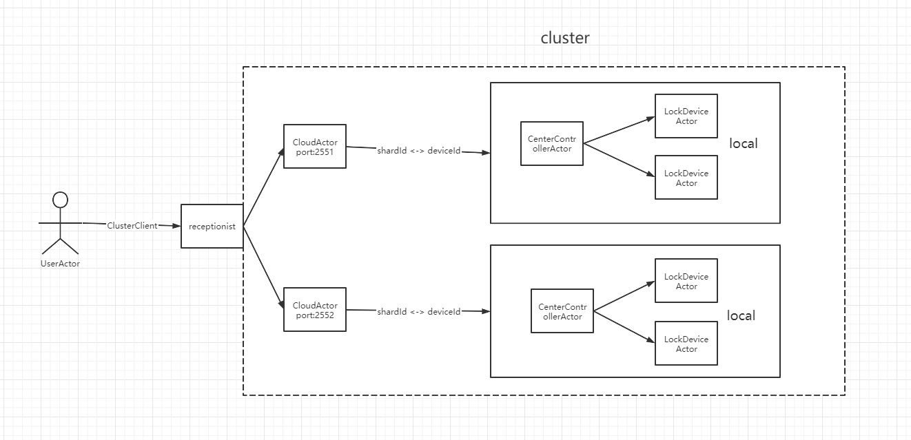

# qianan-quickstart-akka
### 简单模式 simple
启动方式：执行SimpleActor.main

### 远程模式 remote
启动方式：先启动RemoteActor.main，再启动LocalActor.main

### 集群模式 cluster
启动方式：启动Runner.main

### 项目
介绍：用akka的local、cluster和clusterClient模拟的一个物联网指令下发与上报。设备指令从web端->云服务器->中央控制器(路由)->具体硬件，指令下发由UserActor->CloudActor->CenterControllerActor->LockDeviceActor。指令上报则是逆向过程。

项目结构如下：

- 用户通过ClusterClient向集群的接待员发送设备指令，在实际的项目中，用户从web端通过ip port发送请求到服务器，所以这里UserActor用ClusterClient连接到集群的接待员上，由接待员选择一个CloudActor响应请求
- CloudActor与中控Actor连接，这里将中控看成一个处理单元，通过中控的id作为shardId，用户发送的指令需要带上中控id
- 实际项目中，中控是一个小型路由器，发散wifi信号供房间内的各个设备连接。设备通过wifi连接中控，中控连接服务器。所以这个项目模拟中控与具体设备的关系做成了local模式，即都在同一个ActorSystem中
- 该项目模拟了门锁密码新增和删除，已经门锁主动上报密码三种指令。启动后观察控制台打印

如何启动：

- 首先启动com.qianan.akka.device.CloudClient.main 待控制台打印“云端：中控回复Hello成功！”
- 其次启动com.qianan.akka.device.UserClient.main